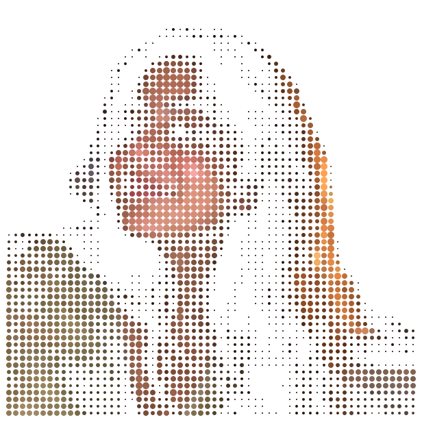
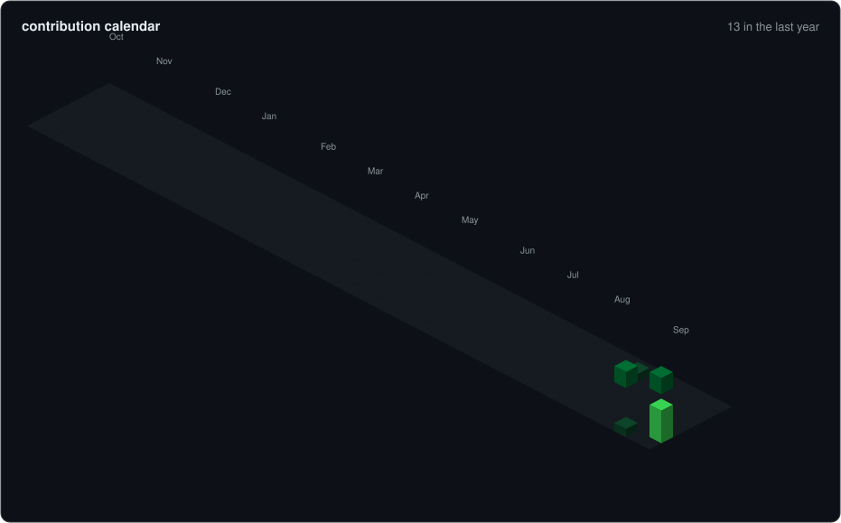
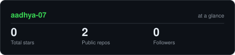
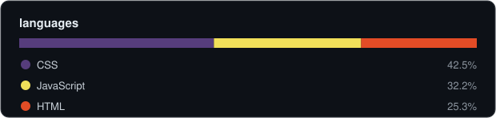
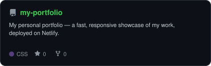
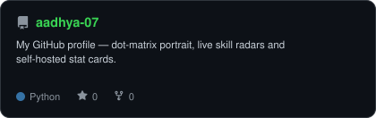

<div align="center">

<!-- PORTRAIT - generated by scripts/dotify.py from a background-cutout photo.
     Colour mode, so one file serves both GitHub themes. Regenerate with:
       python scripts/dotify.py me-cutout.png -o assets/portrait \
         --cols 100 --equalize --detail 0.5 --color -->


<br>

<!-- NAME / TAGLINE - animated typing -->
<a href="https://github.com/aadhya-07">
  
</a>

<br>

<!-- SOCIALS -->
<a href="https://github.com/aadhya-07"></a>
<a href="https://aadhya07.netlify.app"></a>
<a href="https://instagram.com/aadhya_sharma.07"></a>


</div>

---

## `~/` whoami

```console
$ cat about.txt
```

Hi, I'm **Aadhya** — a web developer from Raipur, India. I craft fast, responsive websites and turn ideas into interactive experiences.

- Currently building **[my portfolio](https://aadhya07.netlify.app)** and demo sites for local businesses
- Learning **deeper JavaScript + backend APIs**
- Open to **freelance projects & collabs**

<br>

<div align="center">

## `~/` toolbox


</div>

---

<div align="center">

## `~/` skill radar

<table>
<tr>
<td width="50%" align="center" valign="middle">

<!-- Self-rated radar - edit assets/skills.json, the workflow redraws it -->
<picture>
  <source media="(prefers-color-scheme: dark)"  srcset="assets/radar-dark.svg">
  <source media="(prefers-color-scheme: light)" srcset="assets/radar-light.svg">
  
</picture>

</td>
<td width="50%" align="center" valign="middle">

<!-- Live radar built from real language byte counts across your repos -->
<picture>
  <source media="(prefers-color-scheme: dark)"  srcset="assets/radar-langs-dark.svg">
  <source media="(prefers-color-scheme: light)" srcset="assets/radar-langs-light.svg">
  
</picture>

</td>
</tr>
</table>

</div>

---

<div align="center">

## `~/` contribution calendar

<!-- 3D isometric calendar, regenerated by scripts/profile_refresh.py -->


<br><br>

<!-- Snake eats the contribution graph - regenerated by scripts/profile_refresh.py -->
<picture>
  <source media="(prefers-color-scheme: dark)"  srcset="assets/snake-dark.svg">
  <source media="(prefers-color-scheme: light)" srcset="assets/snake.svg">
  
</picture>

</div>

---

<div align="center">

## `~/` the numbers

<!-- Generated by scripts/cards.py into this repo. Deliberately NOT
     github-readme-stats / streak-stats / github-profile-trophy: those are
     shared public instances that go down and take the whole section with them. -->
<picture>
  <source media="(prefers-color-scheme: dark)"  srcset="assets/card-stats-dark.svg">
  <source media="(prefers-color-scheme: light)" srcset="assets/card-stats-light.svg">
  
</picture>

<br>

<!-- Language mix, regenerated by scripts/profile_refresh.py -->
<picture>
  <source media="(prefers-color-scheme: dark)"  srcset="assets/metrics.languages-dark.svg">
  <source media="(prefers-color-scheme: light)" srcset="assets/metrics.languages-light.svg">
  
</picture>

</div>

---

<div align="center">

## `~/` selected work

<!-- Cards generated by scripts/cards.py from assets/projects.json.
     Stars, forks and language are pulled live from the API on every run. -->
<table>
<tr>
<td width="50%">
  <a href="https://github.com/aadhya-07/my-portfolio">
    <picture>
      <source media="(prefers-color-scheme: dark)"  srcset="assets/card-my-portfolio-dark.svg">
      <source media="(prefers-color-scheme: light)" srcset="assets/card-my-portfolio-light.svg">
      
    </picture>
  </a>
</td>
<td width="50%">
  <a href="https://github.com/aadhya-07/aadhya-07">
    <picture>
      <source media="(prefers-color-scheme: dark)"  srcset="assets/card-aadhya-07-dark.svg">
      <source media="(prefers-color-scheme: light)" srcset="assets/card-aadhya-07-light.svg">
      
    </picture>
  </a>
</td>
</tr>
</table>

<sub>

| project | live | stack |
|---|---|---|
| **[my-portfolio](https://github.com/aadhya-07/my-portfolio)** | [aadhya07.netlify.app](https://aadhya07.netlify.app) | `HTML` `CSS` `JavaScript` |
| **[aadhya-07](https://github.com/aadhya-07/aadhya-07)** | [github.com/aadhya-07](https://github.com/aadhya-07) | `Python` `SVG` |

</sub>

</div>

---

<div align="center">

<sub>`01110011 01100101 01100101 00100000 01111001 01101111 01110101 00100000 01100001 01110010 01101111 01110101 01101110 01100100`</sub>

</div>
